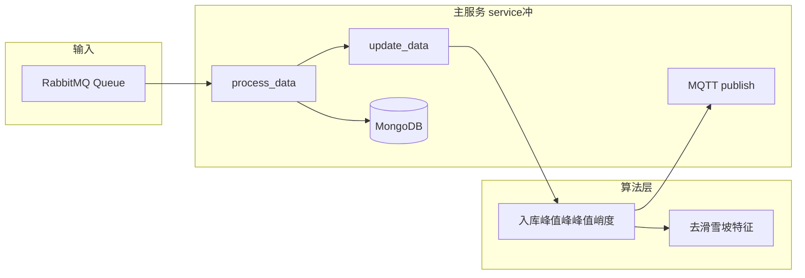

# customMQTT 项目结构分析

## 1. 项目定位

本项目是一个**泵振动算法服务**：从 RabbitMQ 消费波形数据，经信号处理（加速度→速度、峰峰值/峭度等特征）后，将结果通过 MQTT 上报，并将原始/处理后数据写入 MongoDB。主入口同时挂了一个 Flask 应用（当前主要用于承载服务生命周期，未暴露业务 API）。

---

## 2. 目录与文件结构

### 2.1 顶层结构（存在重复）

- **根目录** `f:\customMQTT\` 与 **子目录** `f:\customMQTT\customMQTT\` 内容高度重复：

`config.py`、`mqtt_client.py`、`rabbitmq_client.py`、`service冲.py`、`入库峰值峰峰值峭度.py`、`去滑雪坡特征.py`、`写入数据.py`、`mydb/`、`requirements.txt` 等在两边都有对应文件。

- 建议明确以**根目录**或 **customMQTT 子目录**之一作为唯一工作区，另一侧删除或仅作备份，避免双份维护和运行歧义。

### 2.2 核心模块（以根目录为准）

| 路径 | 职责 |

|------|------|

| [config.py](f:\customMQTT\config.py) | 集中配置：Flask（host/port/debug）、RabbitMQ（host/port/队列名等）、MQTT（broker/port/认证/client_id） |

| [service冲.py](f:\customMQTT\service冲.py) | **主入口**：Flask 应用、MQTT/RabbitMQ 连接、消费回调 `process_data`、算法调用与 MQTT 发布、MongoDB 入库 |

| [rabbitmq_client.py](f:\customMQTT\rabbitmq_client.py) | RabbitMQ 消费者：连接、声明队列、`basic_consume` + 回调、支持 `max_consume` 限流、关闭/停止消费 |

| [mqtt_client.py](f:\customMQTT\mqtt_client.py) | MQTT 发布端：连接、自动重连、`publish` 到指定 topic |

| [入库峰值峰峰值峭度.py](f:\customMQTT\入库峰值峰峰值峭度.py) | 信号处理：加速度去均值、有效值/峭度/峰值/峰峰值、梯形积分得速度、调用“去滑雪坡”滤波，组装上报结构 |

| [去滑雪坡特征.py](f:\customMQTT\去滑雪坡特征.py) | 带通滤波（10–1000 Hz，4 阶 Butterworth）+ 去均值，作为“滑雪坡”特征预处理 |

| [写入数据.py](f:\customMQTT\写入数据.py) | 独立脚本：MongoDB 连接、按条件查询（如 `pump_waveform_report`）、插入测试集合等，非主服务常驻逻辑 |

| [mydb/](f:\customMQTT\mydb) | 数据访问：`get_mongo.py`（MongoDB）、`get_mysql.py`、`get_mongo01.py`、`clear_data.py` 等 |

### 2.3 依赖（requirements.txt）

- `paho-mqtt`、`pika`、`flask`、`numpy`、`pymongo`；算法部分还用到 `scipy`（滤波）、`loguru`（日志），若未在 requirements 中建议补全。

---

## 3. 数据流与调用关系

- **RabbitMQ**：消费队列 `pump.algorithm.quota`（见 config），消息体含 `datas`、`fs`、`time`、`thingsModel`、`sensorId` 等。
- **process_data**（[service冲.py](f:\customMQTT\service冲.py)）：校验必选字段后调用 `update_data(datas, fs, data_time, thingsModel)`，用返回的 `res[0]` 以 topic `/136/{sensor_id}/property/post` 发布到 MQTT，并将原始及处理后数据写入 MongoDB（如 `pump_vel_test1`、`pump_acc_test1`）。
- **update_data**（[入库峰值峰峰值峭度.py](f:\customMQTT\入库峰值峰峰值峭度.py)）：加速度→有效值/峭度/峰值/峰峰值，积分得速度，再调用 `ski_slope(velocity, fs)` 做带通滤波；返回上报用结构与用于入库的数组。
- **ski_slope**（[去滑雪坡特征.py](f:\customMQTT\去滑雪坡特征.py)）：对输入信号做 10–1000 Hz 带通滤波并去均值。

---

## 4. 运行与初始化逻辑（service冲.py）

- 通过 `run_init` 控制：仅在非 debug 或 `WERKZEUG_RUN_MAIN=='true'` 时初始化 MQTT、RabbitMQ，避免 Flask 重载时重复建连。
- 顺序：MQTT `connect()` → 创建 `RabbitMQClient(process_data)` 并 `connect()` → 在**守护线程**中 `start_consuming()` → 主线程 `app.run()`。
- 退出时：设置 `heartbeat_running = False`，`stop_consuming()` + `close()` RabbitMQ，`close()` MQTT。

---

## 5. 小结与可改进点

- **结构**：配置、MQTT/RabbitMQ 客户端、主服务、算法模块、mydb 数据访问分工清晰；算法与“去滑雪坡”单独成文件便于复用。
- **问题**：根目录与 `customMQTT/` 下重复一套代码，需二选一作为主代码库并清理另一侧。
- **可选优化**：在 requirements 中显式加入 `scipy`、`loguru`；将 MongoDB 连接参数与 config 统一（当前 mydb 内仍有硬编码 IP/端口）；考虑把 `process_data` 中入库与 MQTT 发布拆成小函数以提升可测性。

